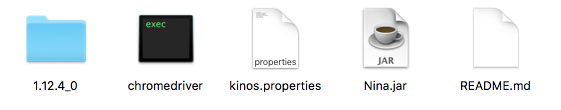

# NinaReleases

## Einmalige Schritte
### Schritt 1: Java installieren
Zur Ausführung des Programms benötigt man die aktuellste Version von Java.
Die kann hier runtergeladen werden: [Download](https://www.java.com/de/).

### Schritt 2: Programm runterladen
Um das Programm runterzuladen oben auf den grünen Button "Clone or Download" und dann auf "Download ZIP" klicken.
Das .zip-File muss auf dem Computer entpackt werden und enthält mindestens die Dateien `Nina.jar` und `kinos.properties`, sowie einen Ordner `1.12.4_0`.

### Schritt 3: Chrome runterladen und aktualisieren
Der "Roboter" benutzt Chrome um die Seite aufzurufen und "durchzulesen". Wenn du das also noch nicht getan hast, 
solltest du jetzt die neuste Version herunterladen: [Download](https://www.google.de/chrome/browser/desktop/).
Falls du irgendeine Version von Chrome bereits installiert hast, solltest du [hier](chrome://help/) prüfen, ob du
ein Update runterladen kannst. Es ist alles gut, wenn da Version 54.irgendwas.irgendwas.irgendwas steht. Ansonsten
wird da irgendwo ein Button "Neu starten" oder "Updates installieren" oder so ähnlich sein.

### Schritt 4: ChromeDriver runterladen und in das Verzeichnis legen
Der ChromeDriver kann die Befehle von meinem Programm in Befehle, die Chrome versteht übersetzen. Du kannst den
[hier](https://sites.google.com/a/chromium.org/chromedriver/downloads) runterladen. Einfach auf den Link neben
"Latest Release" klicken und dann auf `chromedriver_win32.zip`. Die Datei musst du bei dir entpacken. Da ist eine
`chromedriver.exe` drin, mit der du erstmal nichts machen kannst. Wichtig ist nur, dass du die in das gleiche
Verzeichnis legst, wie die `Nina.jar` und die `kinos.properties`. 

### Wenn du alles richtig gemacht hast, sieht dein Ordner jetzt ungefähr so aus:


## Ausführen des Programms
### Schritt 1: Kommandozeile öffnen
Das Programm muss über die Kommandozeile geöffnet werden. Auf einem Windows-Computer drückt man dafür zunächst gleichzeitig die Windowstaste+R.
Dann erscheint ein Feld "Ausführen...". In das Feld gibt man `cmd` ein und drückt die Entertaste. Es sollte sich die Eingebaufforderung öffnen.
Die sieht einfach aus wie DOS früher.

### Schritt 2: In das richtige Verzeichnis wechseln
Als nächstes muss man in das richtige Verzeichnis wechseln. Dafür gibt es den `cd` Befehl. Das richtige Verzeichnis ist das Verzeichnis, in dem
die `Nina.jar` und die `kinos.properties` liegen. Liegen diese Dateien zum Beispiel unter `C:\\Downloads\KinoProgramm`, muss in die Kommandozeile der Befehl `cd C:\\Downloads\KinoProgramm` eingeben werden.

### Schritt 3: Programm starten
Jetzt muss das Programm nur noch gestartet werden. Dazu folgenden Befehl eingeben und ausführen:
```
java -jar Nina.jar
```
Jetzt startet ein neues Fenster von Google Chrome mit zwei Tabs. Im aktiven Tab müsste stehen, dass AdBlock erfolgreich instlaliert wurde. 
Das habe ich nur eingebaut, weil der manchmal nicht damit klargekommen ist, wenn großflächige Werbung über der Webseite lag.
Wenn du auf den anderen Tab wechselst, siehst du die kino.de Webseite und wie der Roboter nach und nach die Tage anklickt. Wichtig ist, dass
du nicht händisch eingreifst, sonst kann es zu Fehlern kommen.

### Schritt 4: Ergebnisse
Das Programm legt die Ergebnisse in einer .txt Datei in genau dem Ordner ab, in dem es gestartet wurde. Die Zahl vor dem .txt sind die vergangenen Millisekunden seit dem 1.1.1970. Das ist einfach nur, damit die Dateien einander nicht überschreiben. Wenn man die nicht mehr braucht, können die .txt-Dateien aber auch ohne Weiteres gelöscht werden.

### Schritt 5: kinos.properties
In der `kinos.properties` befinden sich die Kinos mit den dazugehörigen Telefennummern. Bei jedem Programmaufruf guckt das Programm in die Datei um die Telefonnummern einzutragen. Wenn sich die Nummer eines Kinos ändert, kann man das in der Datei nachpflegen. Das Programm trägt dann fortan die neue Nummer ein. Die Namen der Kinos müssen die gleichen sein wie auf kino.de, aber ohne Leerzeichen. Also `Stanger Kino` ist in der Datei `StangerKino`. Um die Datei zu öffnen, eignet sich jeder TextEditor, wie Notepad.
